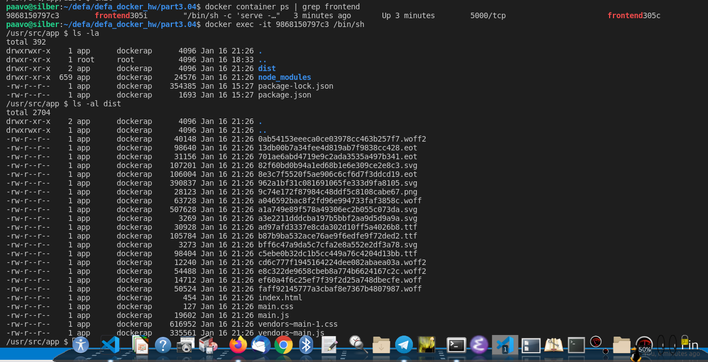

# defa_docker_hw
Defa docker Homeworks, by Paavo Muranen

# Tree - larger exercises have own directory or repository

```code
$ tree
.
├── part1.5
│   ├── Dockerfile
│   ├── README.md
│   └── src
│       └── run_part1.5.sh
├── part1.6
│   ├── Dockerfile
│   ├── Dockerfile~
│   └── README.md
├── part1.7
│   ├── Dockerfile
│   ├── README.md
│   └── src
│       └── run_part1.7.sh
├── part1.8
│   ├── log
│   │   └── logs.txt
│   └── README.md
└── README.md

7 directories, 12 files
```

# PART 1

## [x] 1.1 Prove that you have completed this part of exercise by delivering the output for docker ps -a.
```code
paavo@silber:~/defa/docker$ docker ps -a
CONTAINER ID        IMAGE               COMMAND                  CREATED             STATUS                      PORTS                   NAMES
5a581a67540f        nginx               "nginx -g 'daemon of…"   59 seconds ago      Exited (0) 19 seconds ago                           muranen_docker_1.1_001
4a21f48d5317        nginx               "nginx -g 'daemon of…"   3 minutes ago       Up 3 minutes                0.0.0.0:11113->80/tcp   muranen_docker_1.1_003
970fa53e0342        nginx               "nginx -g 'daemon of…"   5 minutes ago       Exited (0) 15 seconds ago                           muranen_docker_1.1_002
3949610bb4a5        hello-world         "/hello"                 15 minutes ago      Exited (0) 15 minutes ago                           sleepy_gates
c2ad12393dc2        hello-world         "/hello"                 30 minutes ago      Exited (0) 30 minutes ago                           compassionate_chatelet
paavo@silber:~/defa/docker$ curl localhost:11113
<!DOCTYPE html>
<html>
<head>
...
```
## [x] 1.2 Prove that you have completed this part of exercise by delivering the output for docker ps -a and docker images
```code
paavo@silber:~/defa/docker$ docker ps -a
CONTAINER ID        IMAGE               COMMAND             CREATED             STATUS              PORTS               NAMES
paavo@silber:~/defa/docker$ docker images
REPOSITORY          TAG                 IMAGE ID            CREATED             SIZE
```
## [x] 1.3 Submit the secret message and command(s) given to get it as your answer.
```code
paavo@silber:~/defa/docker$ git clone https://github.com/docker-hy/docs-exercise.git
paavo@silber:~/defa/docker$ docker pull devopsdockeruh/pull_exercise
paavo@silber:~/defa/docker$ ls docs-exercise/
Dockerfile  index.js  README.md
paavo@silber:~/defa/docker$ cat docs-exercise/README.md 
This is the readme, use input "basics" to complete this exercise.
paavo@silber:~/defa/docker$ docker run -it devopsdockeruh/pull_exercise
Give me the password: basics
You found the correct password. Secret message is:
"This is the secret message"
```
## [x] 1.4 Submit the secret message and command(s) given as your answer.
```code
paavo@silber:~/defa/docker$ docker run devopsdockeruh/exec_bash_exercise
(node:1) ExperimentalWarning: The fs.promises API is experimental
Wrote to file /usr/app/logs.txt
...clips..
^CClosing file
paavo@silber:~/defa/docker$ date
ma 30.12.2019 20.48.42 +0200
```
Meanwhile in another shell 
```code
root@silber:/var/lib/docker# find . -name logs.txt -print
./overlay2/85ed93555427314e88d8df84804ff4f54e47592d378b7b318c41384baef00893/diff/usr/app/logs.txt
./overlay2/85ed93555427314e88d8df84804ff4f54e47592d378b7b318c41384baef00893/merged/usr/app/logs.txt
root@silber:/var/lib/docker# tail -f ./overlay2/85ed93555427314e88d8df84804ff4f54e47592d378b7b318c41384baef00893/merged/usr/app/logs.txt
...clips..
Mon, 30 Dec 2019 18:48:10 GMT
Mon, 30 Dec 2019 18:48:13 GMT
Secret message is:
"Docker is easy"
Mon, 30 Dec 2019 18:48:19 GMT
^C

root@silber:/var/lib/docker# date
ma 30.12.2019 20.48.30 +0200
```
## [x] 1.5 Dockerfile(s) and the command 
    
    See part1.5 directory for README.md containing answer.


## [x] 1.6 Add a CMD line to the Dockerfile and tag it as “docker-clock” so that docker run docker-clock starts the application and the clock output

    See part1.6 directory for README containing answer.

## [x] 1.7 Run command docker run [options] curler (with correct flags again, as in 1.5) and input helsinki.fi into it. Output should match the 1.5 one.

    Actually this is having the same answer as I had in 1.5 but see part1.7 directory for solution.

## [x] 1.8 Submit your used commands for this exercise.

    See part1.8 directory for README containing answer.

## [x] 1.9 Submit your used commands for this exercise.

```code
docker pull devopsdockeruh/ports_exercise
paavo@silber:~/defa/docker$ docker run -d --name defapart1.9 -p11119:80 devopsdockeruh/ports_exercise
160864aa69633464c7466d85f7c537c79bd4d0ab9b2ca14ee6227a9ab769d285
paavo@silber:~/defa/docker$ curl http://localhost:11119/
Ports configured correctly!!
```
## [x] 1.10 Submit the Dockerfile. your used commands for this exercise.

    See part1.10 for Dockerfile
```code
docker build -t vaapo/frontend-example-docker .
docker run -p5000:5000 vaapo/frontend-example-docker
```
And browse to http://localhost:5000

Exercise 1.10: Congratulations! You configured your ports correctly!

## [x] 1.11 Submit the Dockerfile. your used commands for this exercise.
    See part1.11 for Dockerfile

```code
docker run -it -v $(pwd)/logs.txt:/usr/src/app/logs.txt -p8000:8000 vaapo/backend-example-docker
```
Check the logs.txt by curling the address
```code
$ curl http://localhost:8000
Port configured correctly, generated message in logs.txt


$ tail -f logs.txt 
1/6/2020, 7:00:48 PM: Connection received in root
1/6/2020, 7:01:04 PM: Connection received in root
```
## [x] 1.12 Submit the Dockerfiles. your used commands for this exercise.
No change for the backend.
```
 tree
.
├── backend
│   └── Dockerfile
├── frontend
│   └── Dockerfile
└── frontend-112-test.png

2 directories, 3 files
```

Backend build and run - as in previous 1.11 exercise, no change:
```code

sudo /etc/init.d/webfs stop
docker run -it -v $(pwd)/logs.txt:/usr/src/app/logs.txt -p8000:8000 vaapo/backend-example-docker
```

Frontend build and run
```code
docker build -t vaapo/frontend-example-docker .
docker run -p5000:5000 vaapo/frontend-example-docker
```
Then browse to http://localhost:5000/  
see visual evidence frontend-112-test.png

## [x] 1.13 You’ve completed the exercise when you see a ‘Success’ message in your browser.
```code
$ tree
.
├── Dockerfile
└── spring_113_build_run_test.png

0 directories, 2 files
```

## [x] 1.14 You’ve completed the exercise when the application works in your browser.

Must admit that this was pretty hard to get done, several trials and fighting with ruby version dependencies.
It was also annoying to notice that the server name was not consistently named per version.
Furious googling was needed.

```code
tree part1.14
part1.14
├── Dockerfile
└── rails-build-run-test.png

0 directories, 2 files
```

## [x] 1.15 provide the link to the project in docker hub,  how to run the application in a README

https://hub.docker.com/repository/docker/vaapo/youtube-dl

## [x] 1.16 For this exercise return the url in which the released application is.

https://defadock116.herokuapp.com/

## [x] 1.17 Explain what you created and publish it to Docker Hub.
I am pretty excited about the anaconda jupyter notebooks, so created this small docker with notebook on it.
Because it takes lots of energy to install the notebook to certain environments, thought maybe this could make it easier.

```code
docker pull vaapo/defa_docker_part117
mkdir notebooks
docker run -it -v $(pwd)/notebooks:/notebooks -p 8888:8888 vaapo/defa_docker_part117
```

# PART 2

## [x] 2.1 Submit the docker-compose.yml, make sure that it works simply by running docker-compose up
See part2.1/first_volume_exercise for answer
```
    Secret message is:
    "Volume bind mount is easy"
```

## [x] 2.2 Submit the docker-compose.yml, make sure that it works simply by running docker-compose up
See part2.2/ports_exercises for answer


## [x] 2.3 Submit the docker-compose.yml
Based on 1.12 backend and frontend Dockerfiles constructed part2.3 directory


## [x] 2.4 Your task is to scale the compute containers so that the button in the application turns green.

Scaling to 200 is not good idea :)


## [x] 2.5 Add redis to example backend. Submit the docker-compose.yml

See part2.5-directory. Screenshot of working setup:


## [x] 2.6 Add database to example backend.
    The button won’t turn green but you can send messages to yourself.
    Submit the docker-compose.yml


## [x] 2.7 Configure a machine learning project.


## [x] 2.8 Add nginx to example frontend + backend.
    based on 2.6


## [x] 2.9 Volumes for database and redis
    based on 2.6, because 2.8 cant be used to test this
    $ sudo ls -al `docker inspect part29_redisdata | grep Mountpoint | awk '{print $2}' | sed 's/"//g' | sed 's/,//g'`
    total 12
    drwxr-xr-x 2 guest-kcrwdx paavo 4096 tammi 13 01:07 .
    drwxr-xr-x 3 root         root  4096 tammi 13 00:32 ..
    -rw-r--r-- 1 guest-kcrwdx paavo  125 tammi 13 01:07 dump.rdb

    $ sudo ls -al `docker inspect part29_database | grep Mountpoint | awk '{print $2}' | sed 's/"//g' | sed 's/,//g'`
    total 132
    drwx------ 19 guest-kcrwdx guest-kcrwdx  4096 tammi 13 01:02 .
    drwxr-xr-x  3 root         root          4096 tammi 13 00:32 ..
    drwx------  6 guest-kcrwdx guest-kcrwdx  4096 tammi 13 00:32 base
    drwx------  2 guest-kcrwdx guest-kcrwdx  4096 tammi 13 01:03 global
    drwx------  2 guest-kcrwdx guest-kcrwdx  4096 tammi 13 00:32 pg_commit_ts
    drwx------  2 guest-kcrwdx guest-kcrwdx  4096 tammi 13 00:32 pg_dynshmem
    -rw-------  1 guest-kcrwdx guest-kcrwdx  4535 tammi 13 00:32 pg_hba.conf
    -rw-------  1 guest-kcrwdx guest-kcrwdx  1636 tammi 13 00:32 pg_ident.conf
    drwx------  4 guest-kcrwdx guest-kcrwdx  4096 tammi 13 01:17 pg_logical
    drwx------  4 guest-kcrwdx guest-kcrwdx  4096 tammi 13 00:32 pg_multixact
    drwx------  2 guest-kcrwdx guest-kcrwdx  4096 tammi 13 01:02 pg_notify
    drwx------  2 guest-kcrwdx guest-kcrwdx  4096 tammi 13 00:32 pg_replslot
    drwx------  2 guest-kcrwdx guest-kcrwdx  4096 tammi 13 00:32 pg_serial
    drwx------  2 guest-kcrwdx guest-kcrwdx  4096 tammi 13 00:32 pg_snapshots
    drwx------  2 guest-kcrwdx guest-kcrwdx  4096 tammi 13 01:02 pg_stat
    drwx------  2 guest-kcrwdx guest-kcrwdx  4096 tammi 13 01:26 pg_stat_tmp
    drwx------  2 guest-kcrwdx guest-kcrwdx  4096 tammi 13 00:32 pg_subtrans
    drwx------  2 guest-kcrwdx guest-kcrwdx  4096 tammi 13 00:32 pg_tblspc
    drwx------  2 guest-kcrwdx guest-kcrwdx  4096 tammi 13 00:32 pg_twophase
    -rw-------  1 guest-kcrwdx guest-kcrwdx     3 tammi 13 00:32 PG_VERSION
    drwx------  3 guest-kcrwdx guest-kcrwdx  4096 tammi 13 00:32 pg_wal
    drwx------  2 guest-kcrwdx guest-kcrwdx  4096 tammi 13 00:32 pg_xact
    -rw-------  1 guest-kcrwdx guest-kcrwdx    88 tammi 13 00:32 postgresql.auto.conf
    -rw-------  1 guest-kcrwdx guest-kcrwdx 26588 tammi 13 00:32 postgresql.conf
    -rw-------  1 guest-kcrwdx guest-kcrwdx    36 tammi 13 01:02 postmaster.opts
    -rw-------  1 guest-kcrwdx guest-kcrwdx    94 tammi 13 01:02 postmaster.pid

### configured the redis.conf also


## [x] 2.10 Make sure that every button for exercises works.

Screenshot of working setup:


# PART 3

## [x] 3.01 Optimize dockerfiles and document changes
### BEFORE 1716.0 Mb
### AFTER 1515.9 Mb
    Starting situation
    paavo@silber:~/defa/defa_docker_hw/part2.10$ docker-compose images
    /usr/lib/python2.7/dist-packages/requests/__init__.py:80: RequestsDependencyWarning: urllib3 (1.22) or chardet (2.1.1) doesn't match a supported version!
    RequestsDependencyWarning)
            Container                    Repository              Tag       Image Id      Size  
    -------------------------------------------------------------------------------------------
    adminer_container10         adminer                         latest   50516a0a687a   86.9 MB
    backend-example-docker10    vaapo/backend-example-docker    latest   af88ed6181db   539 MB 
    frontend-example-docker10   vaapo/frontend-example-docker   latest   4144eea94c5e   631 MB 
    postgres_container10        postgres                        latest   ec5d6d5f5b34   375 MB 
    redis_container10           redis                           alpine   8af6a13284bf   31.5 MB
    vaapo_proxy_nginx10         vaapo/nginx10                   latest   bfeada42e62f   52.6 MB

### optimization happens heredefa_docker_hw/part3.01
### AFTER
    part3.01$ docker-compose images
    /usr/lib/python2.7/dist-packages/requests/__init__.py:80: RequestsDependencyWarning: urllib3 (1.22) or chardet (2.1.1) doesn't match a supported version!
    RequestsDependencyWarning)
            Container                      Repository               Tag       Image Id      Size  
    ----------------------------------------------------------------------------------------------
    adminer_container301         adminer                           latest   50516a0a687a   86.9 MB
    backend-example-docker301    vaapo/backend-example-docker301   latest   9e2ff29671eb   455 MB 
    frontend-example-docker301   vaapo/frontend-example-docker     latest   ed59a1107c9d   547 MB 
    postgres_container301        postgres                          latest   ec5d6d5f5b34   375 MB 
    redis_container301           redis                             alpine   8af6a13284bf   31.5 MB
    vaapo_proxy_nginx301         proxy301test                      latest   e1e899c8c890   20.5 MB

    1515.9 Mb

## 3.02 [x] optimize yle-dl
### BEFORE
    $ docker image ls
    REPOSITORY                              TAG                 IMAGE ID            CREATED              SIZE
    yledl302test                            latest              b090458492fb        About a minute ago   311MB

### After
    part3.02$ docker image ls
    REPOSITORY                              TAG                 IMAGE ID            CREATED             SIZE
    yledl302testopt2                        latest              cc549a1af74a        2 minutes ago       205MB

## 3.03 [x] Make sure the containers start their processes as a non-root user.
    
    Based on 2.10 setup move to app-user from root. I am using this to be able to exec to shell and see.
    Otherwise could do it based on 3.01.

    configured for proxy, frontend, backend:
        Non-root user: app
        Non-rootl group: dockerapp
### screenshots


### nginx log files omitted due stdout + postgres and redis

## 3.04 [x] Switch to node docker packages and document before and after sizes of frontend and backend

### BEFORE *docker304 and AFTER *304i
    $ docker image ls | grep 304 | grep end
    backend304i                             latest              d544faa4d961        24 minutes ago      115MB
    frontend304i                            latest              20949ebde2bf        40 minutes ago      213MB
    vaapo/frontend-example-docker304        latest              5a7d74c4b158        8 hours ago         662MB
    vaapo/backend-example-docker304         latest              de71eb6f8b5b        8 hours ago         661MB


### Remarks
Noticed later that I had very strainge chown-operation and this was causing bloated images also for the ready node images.
The steps with "chown -R app:dockerapp ..." caused the image size to grow 48MB per each. So by removing it and solving the COPY with chown was better.
So perhaps I could have done it also with the ready-images and reached the similar results.

    paavo@silber:~/defa/defa_docker_hw/part3.04$ docker history backend304i
    IMAGE               CREATED             CREATED BY                                      SIZE                COMMENT
    9ac187def999        5 minutes ago       /bin/sh -c #(nop)  CMD ["/bin/sh" "-c" "npm …   0B                  
    c682eca7282a        5 minutes ago       /bin/sh -c #(nop)  USER app                     0B                  
    db10a10df5ad        5 minutes ago       /bin/sh -c chown -R app:dockerapp ./*           48.1MB              
    42adfeed0872        7 minutes ago       /bin/sh -c chown -R app:dockerapp .             48.1MB              
    f4d459f4677b        8 minutes ago       /bin/sh -c #(nop)  EXPOSE 8000                  0B       

## [x] 3.05 Do a multi-stage build for the frontend project since we’ve come so far with the application.

view to frontend service in shell, see dist and node_modules only.


    $ docker container ps | grep frontend
    9868150797c3        frontend305i        "/bin/sh -c 'serve -…"   3 minutes ago       Up 3 minutes        5000/tcp                       frontend305c
    paavo@silber:~/defa/defa_docker_hw/part3.04$ docker exec -it 9868150797c3 /bin/sh
    /usr/src/app $ ls -la
    total 392
    drwxrwxr-x    1 app      dockerap      4096 Jan 16 21:26 .
    drwxr-xr-x    1 root     root          4096 Jan 16 18:33 ..
    drwxr-xr-x    2 app      dockerap      4096 Jan 16 21:26 dist
    drwxr-xr-x  659 app      dockerap     24576 Jan 16 21:26 node_modules
    -rw-r--r--    1 app      dockerap    354385 Jan 16 15:27 package-lock.json
    -rw-r--r--    1 app      dockerap      1693 Jan 16 15:27 package.json
    /usr/src/app $ ls -al dist
    total 2704
    drwxr-xr-x    2 app      dockerap      4096 Jan 16 21:26 .
    drwxrwxr-x    1 app      dockerap      4096 Jan 16 21:26 ..
    -rw-r--r--    1 app      dockerap     40148 Jan 16 21:26 0ab54153eeeca0ce03978cc463b257f7.woff2
    -rw-r--r--    1 app      dockerap     98640 Jan 16 21:26 13db00b7a34fee4d819ab7f9838cc428.eot
    -rw-r--r--    1 app      dockerap     31156 Jan 16 21:26 701ae6abd4719e9c2ada3535a497b341.eot
    -rw-r--r--    1 app      dockerap    107201 Jan 16 21:26 82f60bd0b94a1ed68b1e6e309ce2e8c3.svg
    -rw-r--r--    1 app      dockerap    106004 Jan 16 21:26 8e3c7f5520f5ae906c6cf6d7f3ddcd19.eot
    -rw-r--r--    1 app      dockerap    390837 Jan 16 21:26 962a1bf31c081691065fe333d9fa8105.svg
    -rw-r--r--    1 app      dockerap     28123 Jan 16 21:26 9c74e172f87984c48ddf5c8108cabe67.png
    -rw-r--r--    1 app      dockerap     63728 Jan 16 21:26 a046592bac8f2fd96e994733faf3858c.woff
    -rw-r--r--    1 app      dockerap    507628 Jan 16 21:26 a1a749e89f578a49306ec2b055c073da.svg
    -rw-r--r--    1 app      dockerap      3269 Jan 16 21:26 a3e2211dddcba197b5bbf2aa9d5d9a9a.svg
    -rw-r--r--    1 app      dockerap     30928 Jan 16 21:26 ad97afd3337e8cda302d10ff5a4026b8.ttf
    -rw-r--r--    1 app      dockerap    105784 Jan 16 21:26 b87b9ba532ace76ae9f6edfe9f72ded2.ttf
    -rw-r--r--    1 app      dockerap      3273 Jan 16 21:26 bff6c47a9da5c7cfa2e8a552e2df3a78.svg
    -rw-r--r--    1 app      dockerap     98404 Jan 16 21:26 c5ebe0b32dc1b5cc449a76c4204d13bb.ttf
    -rw-r--r--    1 app      dockerap     12240 Jan 16 21:26 cd6c777f1945164224dee082abaea03a.woff2
    -rw-r--r--    1 app      dockerap     54488 Jan 16 21:26 e8c322de9658cbeb8a774b6624167c2c.woff2
    -rw-r--r--    1 app      dockerap     14712 Jan 16 21:26 ef60a4f6c25ef7f39f2d25a748dbecfe.woff
    -rw-r--r--    1 app      dockerap     50524 Jan 16 21:26 faff92145777a3cbaf8e7367b4807987.woff
    -rw-r--r--    1 app      dockerap       454 Jan 16 21:26 index.html
    -rw-r--r--    1 app      dockerap       127 Jan 16 21:26 main.css
    -rw-r--r--    1 app      dockerap     19602 Jan 16 21:26 main.js
    -rw-r--r--    1 app      dockerap    616952 Jan 16 21:26 vendors~main-1.css
    -rw-r--r--    1 app      dockerap    335561 Jan 16 21:26 vendors~main.js



