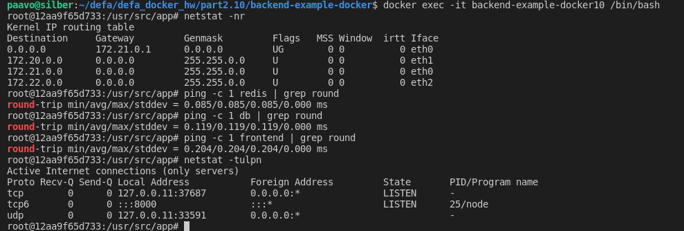
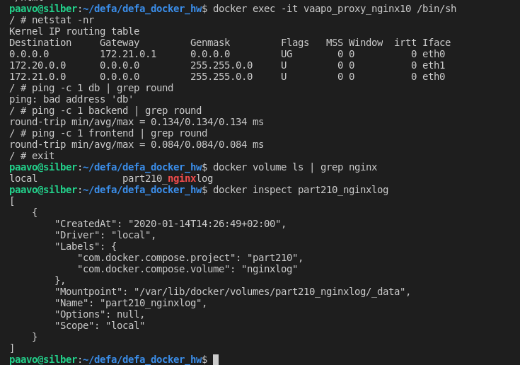
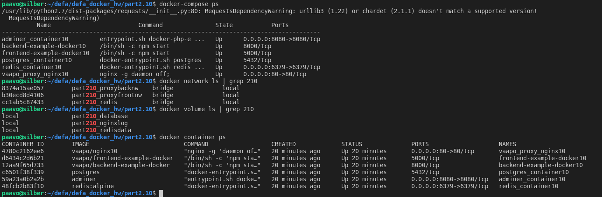

# # Exercise 2.10 FIX BUTTONS

Cloned the following github repositories and used the answer from exercise 2.9. and 2.8 nginx

Glory for the backend and frontend goes to Helsinki https://github.com/docker-hy

And https://hub.docker.com/_/redis/
https://hub.docker.com/_/postgres/

# CORS challenge indeed - dont take this path

https://enable-cors.org/server_nginx.html

# FILES

```code
```

# Setup
Compose does the magic.
```code
docker-compose build
docker-compose up
docker-compose down
```
    
# RUN
```code
docker-compose up
```

# test

# Check with browser http://localhost:80/

Screenshot of working setup:


# Check adminer with browser http://localhost:8080/


# exec sh in services

## backend exec sh


## nginx proxy exec


## containers etc.


# check volumes
    $ docker volume ls
    DRIVER              VOLUME NAME
    local               5a8b9f231f74ccb7c71428d020208b07e4da536fb02172dc3addd81e985db9c8
    local               ab49265b80651d8754f53ebfc801bb5d8e11a5673fe14911d314e4de9c5983ef
    local               b8fba24f0e74da11701a1d3a9d2109a4b942549fccf449a5b2a8c70a120fb8f7
    local               part28_database
    local               part29_database
    local               part29_redisdata

    $ docker volume inspect part29_database
    [
        {
            "CreatedAt": "2020-01-13T00:32:25+02:00",
            "Driver": "local",
            "Labels": {
                "com.docker.compose.project": "part29",
                "com.docker.compose.volume": "database"
            },
            "Mountpoint": "/var/lib/docker/volumes/part29_database/_data",
            "Name": "part29_database",
            "Options": null,
            "Scope": "local"
        }
    ]
    $ sudo ls -al /var/lib/docker/volumes/part29_database/_data
    total 132
    drwx------ 19 guest-kcrwdx guest-kcrwdx  4096 tammi 13 00:32 .
    drwxr-xr-x  3 root         root          4096 tammi 13 00:32 ..
    drwx------  6 guest-kcrwdx guest-kcrwdx  4096 tammi 13 00:32 base
    drwx------  2 guest-kcrwdx guest-kcrwdx  4096 tammi 13 00:33 global
    drwx------  2 guest-kcrwdx guest-kcrwdx  4096 tammi 13 00:32 pg_commit_ts
    drwx------  2 guest-kcrwdx guest-kcrwdx  4096 tammi 13 00:32 pg_dynshmem
    -rw-------  1 guest-kcrwdx guest-kcrwdx  4535 tammi 13 00:32 pg_hba.conf
    -rw-------  1 guest-kcrwdx guest-kcrwdx  1636 tammi 13 00:32 pg_ident.conf
    drwx------  4 guest-kcrwdx guest-kcrwdx  4096 tammi 13 00:37 pg_logical
    drwx------  4 guest-kcrwdx guest-kcrwdx  4096 tammi 13 00:32 pg_multixact
    drwx------  2 guest-kcrwdx guest-kcrwdx  4096 tammi 13 00:32 pg_notify
    drwx------  2 guest-kcrwdx guest-kcrwdx  4096 tammi 13 00:32 pg_replslot
    drwx------  2 guest-kcrwdx guest-kcrwdx  4096 tammi 13 00:32 pg_serial
    drwx------  2 guest-kcrwdx guest-kcrwdx  4096 tammi 13 00:32 pg_snapshots
    drwx------  2 guest-kcrwdx guest-kcrwdx  4096 tammi 13 00:32 pg_stat
    drwx------  2 guest-kcrwdx guest-kcrwdx  4096 tammi 13 00:37 pg_stat_tmp
    drwx------  2 guest-kcrwdx guest-kcrwdx  4096 tammi 13 00:32 pg_subtrans
    drwx------  2 guest-kcrwdx guest-kcrwdx  4096 tammi 13 00:32 pg_tblspc
    drwx------  2 guest-kcrwdx guest-kcrwdx  4096 tammi 13 00:32 pg_twophase
    -rw-------  1 guest-kcrwdx guest-kcrwdx     3 tammi 13 00:32 PG_VERSION
    drwx------  3 guest-kcrwdx guest-kcrwdx  4096 tammi 13 00:32 pg_wal
    drwx------  2 guest-kcrwdx guest-kcrwdx  4096 tammi 13 00:32 pg_xact
    -rw-------  1 guest-kcrwdx guest-kcrwdx    88 tammi 13 00:32 postgresql.auto.conf
    -rw-------  1 guest-kcrwdx guest-kcrwdx 26588 tammi 13 00:32 postgresql.conf
    -rw-------  1 guest-kcrwdx guest-kcrwdx    36 tammi 13 00:32 postmaster.opts
    -rw-------  1 guest-kcrwdx guest-kcrwdx    94 tammi 13 00:32 postmaster.pid

    $ docker volume inspect part29_redisdata
    [
        {
            "CreatedAt": "2020-01-13T00:32:21+02:00",
            "Driver": "local",
            "Labels": {
                "com.docker.compose.project": "part29",
                "com.docker.compose.volume": "redisdata"
            },
            "Mountpoint": "/var/lib/docker/volumes/part29_redisdata/_data",
            "Name": "part29_redisdata",
            "Options": null,
            "Scope": "local"
        }
    ]
    $ sudo ls -al /var/lib/docker/volumes/part29_redisdata/_data
    [sudo] password for paavo: 
    total 8
    drwxr-xr-x 2 guest-kcrwdx paavo 4096 tammi  3 03:31 .
    drwxr-xr-x 3 root         root  4096 tammi 13 00:32 ..

    $ redis-cli
    127.0.0.1:6379> ping
    PONG
    127.0.0.1:6379> set mykey toimistna
    OK
    127.0.0.1:6379> get mykey
    "toimistna"
    127.0.0.1:6379> save
    OK
    $ sudo ls -al /var/lib/docker/volumes/part29_redisdata/_data
    total 12
    drwxr-xr-x 2 guest-kcrwdx paavo 4096 tammi 13 01:07 .
    drwxr-xr-x 3 root         root  4096 tammi 13 00:32 ..
    -rw-r--r-- 1 guest-kcrwdx paavo  125 tammi 13 01:07 dump.rdb

    BUT why the app doesnt save redis data?
    $ sudo docker exec -it c2b2da25c4ce /bin/sh
    /data # ls -al
    total 12
    drwxr-xr-x    2 redis    redis         4096 Jan 12 23:07 .
    drwxr-xr-x    1 root     root          4096 Jan 12 22:45 ..
    -rw-r--r--    1 redis    redis          125 Jan 12 23:07 dump.rdb
    /data # 

# check volumes on host
    $ sudo ls -al `docker inspect part29_redisdata | grep Mountpoint | awk '{print $2}' | sed 's/"//g' | sed 's/,//g'`
    total 12
    drwxr-xr-x 2 guest-kcrwdx paavo 4096 tammi 13 01:07 .
    drwxr-xr-x 3 root         root  4096 tammi 13 00:32 ..
    -rw-r--r-- 1 guest-kcrwdx paavo  125 tammi 13 01:07 dump.rdb

    $ sudo ls -al `docker inspect part29_database | grep Mountpoint | awk '{print $2}' | sed 's/"//g' | sed 's/,//g'`
    total 132
    drwx------ 19 guest-kcrwdx guest-kcrwdx  4096 tammi 13 01:02 .
    drwxr-xr-x  3 root         root          4096 tammi 13 00:32 ..
    drwx------  6 guest-kcrwdx guest-kcrwdx  4096 tammi 13 00:32 base
    drwx------  2 guest-kcrwdx guest-kcrwdx  4096 tammi 13 01:03 global
    drwx------  2 guest-kcrwdx guest-kcrwdx  4096 tammi 13 00:32 pg_commit_ts
    drwx------  2 guest-kcrwdx guest-kcrwdx  4096 tammi 13 00:32 pg_dynshmem
    -rw-------  1 guest-kcrwdx guest-kcrwdx  4535 tammi 13 00:32 pg_hba.conf
    -rw-------  1 guest-kcrwdx guest-kcrwdx  1636 tammi 13 00:32 pg_ident.conf
    drwx------  4 guest-kcrwdx guest-kcrwdx  4096 tammi 13 01:17 pg_logical
    drwx------  4 guest-kcrwdx guest-kcrwdx  4096 tammi 13 00:32 pg_multixact
    drwx------  2 guest-kcrwdx guest-kcrwdx  4096 tammi 13 01:02 pg_notify
    drwx------  2 guest-kcrwdx guest-kcrwdx  4096 tammi 13 00:32 pg_replslot
    drwx------  2 guest-kcrwdx guest-kcrwdx  4096 tammi 13 00:32 pg_serial
    drwx------  2 guest-kcrwdx guest-kcrwdx  4096 tammi 13 00:32 pg_snapshots
    drwx------  2 guest-kcrwdx guest-kcrwdx  4096 tammi 13 01:02 pg_stat
    drwx------  2 guest-kcrwdx guest-kcrwdx  4096 tammi 13 01:26 pg_stat_tmp
    drwx------  2 guest-kcrwdx guest-kcrwdx  4096 tammi 13 00:32 pg_subtrans
    drwx------  2 guest-kcrwdx guest-kcrwdx  4096 tammi 13 00:32 pg_tblspc
    drwx------  2 guest-kcrwdx guest-kcrwdx  4096 tammi 13 00:32 pg_twophase
    -rw-------  1 guest-kcrwdx guest-kcrwdx     3 tammi 13 00:32 PG_VERSION
    drwx------  3 guest-kcrwdx guest-kcrwdx  4096 tammi 13 00:32 pg_wal
    drwx------  2 guest-kcrwdx guest-kcrwdx  4096 tammi 13 00:32 pg_xact
    -rw-------  1 guest-kcrwdx guest-kcrwdx    88 tammi 13 00:32 postgresql.auto.conf
    -rw-------  1 guest-kcrwdx guest-kcrwdx 26588 tammi 13 00:32 postgresql.conf
    -rw-------  1 guest-kcrwdx guest-kcrwdx    36 tammi 13 01:02 postmaster.opts
    -rw-------  1 guest-kcrwdx guest-kcrwdx    94 tammi 13 01:02 postmaster.pid

    $ docker exec -it postgres_container9 psql --dbname=defadockerdb --username=kuikka --password
    Password: 
    psql (12.1 (Debian 12.1-1.pgdg100+1))
    Type "help" for help.

    defadockerdb=# \d
                List of relations
    Schema |      Name       |   Type   | Owner  
    --------+-----------------+----------+--------
    public | messages        | table    | kuikka
    public | messages_id_seq | sequence | kuikka
    (2 rows)

    defadockerdb=# select * from public.messages;
    id |        body        |         createdAt          |         updatedAt          
    ----+--------------------+----------------------------+----------------------------
    1 | low watermark      | 2020-01-12 22:33:42.512+00 | 2020-01-12 22:33:42.512+00
    2 | some stuff         | 2020-01-12 22:33:53.836+00 | 2020-01-12 22:33:53.836+00
    3 | some stuff 2       | 2020-01-12 22:40:13.527+00 | 2020-01-12 22:40:13.527+00
    4 | freaking redis     | 2020-01-12 22:46:15.547+00 | 2020-01-12 22:46:15.547+00
    5 | freaking redis2    | 2020-01-12 22:50:01.752+00 | 2020-01-12 22:50:01.752+00
    6 | freaking redis23   | 2020-01-12 22:50:05.275+00 | 2020-01-12 22:50:05.275+00
    7 | freaking redis234  | 2020-01-12 22:50:08.044+00 | 2020-01-12 22:50:08.044+00
    8 | freaking redis2345 | 2020-01-12 22:50:10.255+00 | 2020-01-12 22:50:10.255+00
    9 | Empty message      | 2020-01-12 22:55:51.478+00 | 2020-01-12 22:55:51.478+00
    10 | duuu               | 2020-01-12 22:55:56.348+00 | 2020-01-12 22:55:56.348+00
    11 | duuusd             | 2020-01-12 23:16:03.297+00 | 2020-01-12 23:16:03.297+00
    12 | duuusdd            | 2020-01-12 23:16:10.096+00 | 2020-01-12 23:16:10.096+00
    (12 rows)

    defadockerdb=# 
    $ redis-cli monitor
    OK
    1578932773.075056 [0 172.25.0.1:59632] "get" "slow"
    1578932777.417120 [0 172.25.0.1:59632] "get" "slow"
    1578932779.041981 [0 172.25.0.1:59632] "get" "slow"

## Telegram discussion with Joni - about redis AOF

    decided to put /data/redis.conf and a line https://redis.io/topics/persistence
    appendonly yes


            