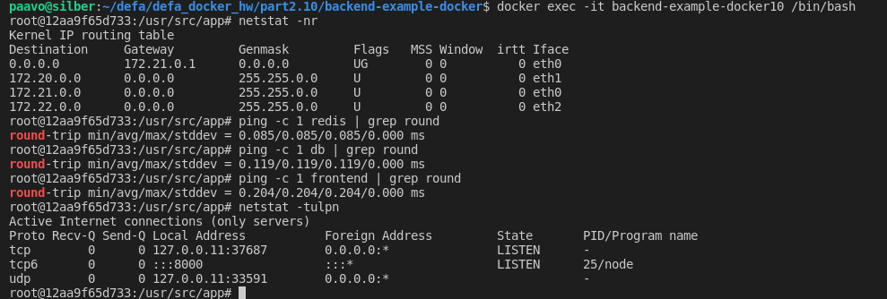
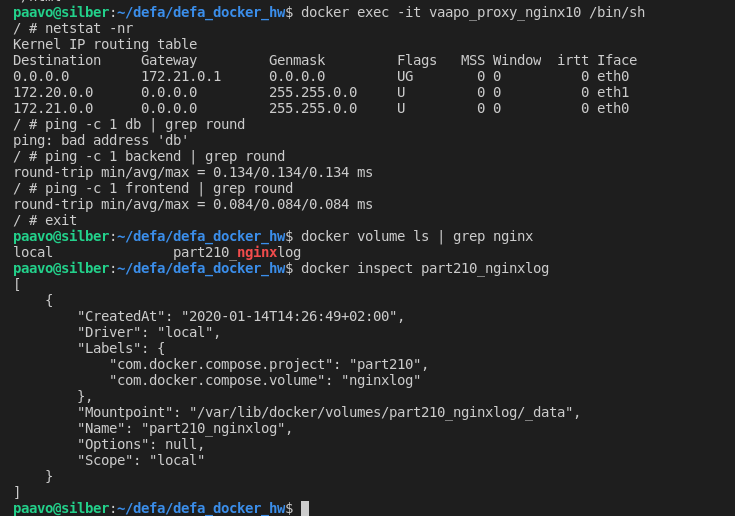
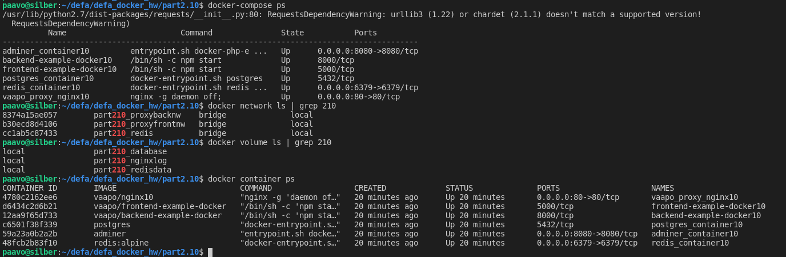

# 3.03 [x] Make sure the containers start their processes as a non-root user.

   Based on 2.10 setup move to app-user from root. I am using this to be able to exec to shell and see.
    Otherwise could do it based on 3.01.

Glory for the backend and frontend goes to Helsinki https://github.com/docker-hy

And https://hub.docker.com/_/redis/
https://hub.docker.com/_/postgres/


# FILES

In containers, the USER app should own the directories. Otherwise this sort of errors occurs:
    npm WARN checkPermissions Missing write access to /usr/src/app

```code
```

# Setup
Compose does the magic.
```code
docker-compose build
docker-compose up
docker-compose down
```
    
# RUN
```code
docker-compose up
```

# test

# Check with browser http://localhost:80/

Screenshot of working setup:


# Check adminer with browser http://localhost:8080/


# exec sh in services

## backend exec sh


## nginx proxy exec


## containers etc.


