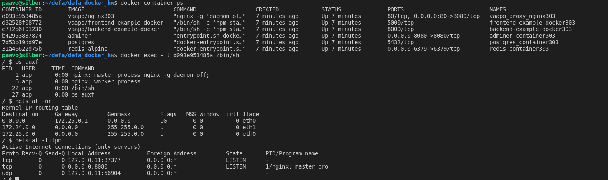
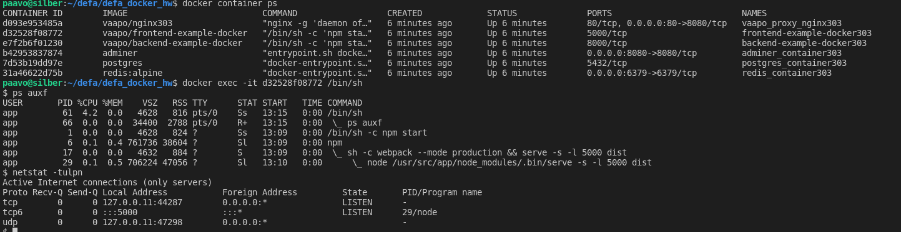

# 3.03 [x] Make sure the containers start their processes as a non-root user.

   Based on 2.10 setup move to app-user from root. I am using this to be able to exec to shell and see.
    Otherwise could do it based on 3.01.

Glory for the backend and frontend goes to Helsinki https://github.com/docker-hy

configured for proxy, frontend, backend:
    Non-root user: app
    Non-rootl group: dockerapp

## nginx proxy running as app:dockerapp
See nginx.conf for pid file and Dockerfile for proxy for chowning relevant directories for nginx

    $ docker container ps
    CONTAINER ID        IMAGE                           COMMAND                  CREATED             STATUS              PORTS                          NAMES
    d093e953485a        vaapo/nginx303                  "nginx -g 'daemon of…"   7 minutes ago       Up 7 minutes        80/tcp, 0.0.0.0:80->8080/tcp   vaapo_proxy_nginx303
    d32528f08772        vaapo/frontend-example-docker   "/bin/sh -c 'npm sta…"   7 minutes ago       Up 7 minutes        5000/tcp                       frontend-example-docker303
    e7f2b6f01230        vaapo/backend-example-docker    "/bin/sh -c 'npm sta…"   7 minutes ago       Up 7 minutes        8000/tcp                       backend-example-docker303
    b42953837874        adminer                         "entrypoint.sh docke…"   7 minutes ago       Up 7 minutes        0.0.0.0:8080->8080/tcp         adminer_container303
    7d53b19dd97e        postgres                        "docker-entrypoint.s…"   7 minutes ago       Up 7 minutes        5432/tcp                       postgres_container303
    31a46622d75b        redis:alpine                    "docker-entrypoint.s…"   7 minutes ago       Up 7 minutes        0.0.0.0:6379->6379/tcp         redis_container303
    $ docker exec -it d093e953485a /bin/sh
    / $ ps auxf
    PID   USER     TIME  COMMAND
        1 app       0:00 nginx: master process nginx -g daemon off;
        6 app       0:00 nginx: worker process
    22 app       0:00 /bin/sh
    27 app       0:00 ps auxf
    / $ netstat -nr
    Kernel IP routing table
    Destination     Gateway         Genmask         Flags   MSS Window  irtt Iface
    0.0.0.0         172.25.0.1      0.0.0.0         UG        0 0          0 eth0
    172.24.0.0      0.0.0.0         255.255.0.0     U         0 0          0 eth1
    172.25.0.0      0.0.0.0         255.255.0.0     U         0 0          0 eth0
    / $ netstat -tulpn
    Active Internet connections (only servers)
    Proto Recv-Q Send-Q Local Address           Foreign Address         State       PID/Program name    
    tcp        0      0 127.0.0.11:37377        0.0.0.0:*               LISTEN      -                   
    tcp        0      0 0.0.0.0:8080            0.0.0.0:*               LISTEN      1/nginx: master pro 
    udp        0      0 127.0.0.11:56904        0.0.0.0:*                           -                   
    / $ 

## frontend running as app:dockerapp
See Dockerfile

    $ docker container ps
    CONTAINER ID        IMAGE                           COMMAND                  CREATED             STATUS              PORTS                          NAMES
    d093e953485a        vaapo/nginx303                  "nginx -g 'daemon of…"   6 minutes ago       Up 6 minutes        80/tcp, 0.0.0.0:80->8080/tcp   vaapo_proxy_nginx303
    d32528f08772        vaapo/frontend-example-docker   "/bin/sh -c 'npm sta…"   6 minutes ago       Up 6 minutes        5000/tcp                       frontend-example-docker303
    e7f2b6f01230        vaapo/backend-example-docker    "/bin/sh -c 'npm sta…"   6 minutes ago       Up 6 minutes        8000/tcp                       backend-example-docker303
    b42953837874        adminer                         "entrypoint.sh docke…"   6 minutes ago       Up 6 minutes        0.0.0.0:8080->8080/tcp         adminer_container303
    7d53b19dd97e        postgres                        "docker-entrypoint.s…"   6 minutes ago       Up 6 minutes        5432/tcp                       postgres_container303
    31a46622d75b        redis:alpine                    "docker-entrypoint.s…"   6 minutes ago       Up 6 minutes        0.0.0.0:6379->6379/tcp         redis_container303
    $ docker exec -it d32528f08772 /bin/sh
    $ ps auxf
    USER       PID %CPU %MEM    VSZ   RSS TTY      STAT START   TIME COMMAND
    app         61  4.2  0.0   4628   816 pts/0    Ss   13:15   0:00 /bin/sh
    app         66  0.0  0.0  34400  2788 pts/0    R+   13:15   0:00  \_ ps auxf
    app          1  0.0  0.0   4628   824 ?        Ss   13:09   0:00 /bin/sh -c npm start
    app          6  0.1  0.4 761736 38604 ?        Sl   13:09   0:00 npm
    app         17  0.0  0.0   4632   884 ?        S    13:09   0:00  \_ sh -c webpack --mode production && serve -s -l 5000 dist
    app         29  0.1  0.5 706224 47056 ?        Sl   13:10   0:00      \_ node /usr/src/app/node_modules/.bin/serve -s -l 5000 dist
    $ netstat -tulpn
    Active Internet connections (only servers)
    Proto Recv-Q Send-Q Local Address           Foreign Address         State       PID/Program name    
    tcp        0      0 127.0.0.11:44287        0.0.0.0:*               LISTEN      -                   
    tcp6       0      0 :::5000                 :::*                    LISTEN      29/node             
    udp        0      0 127.0.0.11:47298        0.0.0.0:*                           -                   
    $ 

## backend running as app:dockerapp
See Dockerfile

    $ docker container ps
    CONTAINER ID        IMAGE                           COMMAND                  CREATED             STATUS              PORTS                          NAMES
    d093e953485a        vaapo/nginx303                  "nginx -g 'daemon of…"   3 minutes ago       Up 3 minutes        80/tcp, 0.0.0.0:80->8080/tcp   vaapo_proxy_nginx303
    d32528f08772        vaapo/frontend-example-docker   "/bin/sh -c 'npm sta…"   3 minutes ago       Up 3 minutes        5000/tcp                       frontend-example-docker303
    e7f2b6f01230        vaapo/backend-example-docker    "/bin/sh -c 'npm sta…"   3 minutes ago       Up 3 minutes        8000/tcp                       backend-example-docker303
    b42953837874        adminer                         "entrypoint.sh docke…"   3 minutes ago       Up 3 minutes        0.0.0.0:8080->8080/tcp         adminer_container303
    7d53b19dd97e        postgres                        "docker-entrypoint.s…"   3 minutes ago       Up 3 minutes        5432/tcp                       postgres_container303
    31a46622d75b        redis:alpine                    "docker-entrypoint.s…"   3 minutes ago       Up 3 minutes        0.0.0.0:6379->6379/tcp         redis_container303
    $ docker exec -it e7f2b6f01230 /bin/sh
    $ ps auxf
    USER       PID %CPU %MEM    VSZ   RSS TTY      STAT START   TIME COMMAND
    app         38  9.0  0.0   4628   912 pts/0    Ss   13:13   0:00 /bin/sh
    app         43  0.0  0.0  34400  2804 pts/0    R+   13:13   0:00  \_ ps auxf
    app          1  0.0  0.0   4628   804 ?        Ss   13:09   0:00 /bin/sh -c npm start
    app          8  0.2  0.4 761712 38828 ?        Sl   13:09   0:00 npm
    app         19  0.0  0.0   4632   832 ?        S    13:09   0:00  \_ sh -c cross-env NODE_ENV=production node index.js
    app         20  0.0  0.4 589920 32380 ?        Sl   13:09   0:00      \_ node /usr/src/app/node_modules/.bin/cross-env NODE_ENV=production node index.js
    app         27  1.2  0.8 943140 68220 ?        Sl   13:09   0:03          \_ node index.js
    $ netstat -nr
    Kernel IP routing table
    Destination     Gateway         Genmask         Flags   MSS Window  irtt Iface
    0.0.0.0         172.25.0.1      0.0.0.0         UG        0 0          0 eth0
    172.24.0.0      0.0.0.0         255.255.0.0     U         0 0          0 eth1
    172.25.0.0      0.0.0.0         255.255.0.0     U         0 0          0 eth0
    172.29.0.0      0.0.0.0         255.255.0.0     U         0 0          0 eth2
    $ 

#### nginx log files are still owned by root
    $ docker inspect part303_nginxlog
    [
        {
            "CreatedAt": "2020-01-16T12:51:28+02:00",
            "Driver": "local",
            "Labels": {
                "com.docker.compose.project": "part303",
                "com.docker.compose.volume": "nginxlog"
            },
            "Mountpoint": "/var/lib/docker/volumes/part303_nginxlog/_data",
            "Name": "part303_nginxlog",
            "Options": null,
            "Scope": "local"
        }
    ]
    $ sudo ls -al /var/lib/docker/volumes/part303_nginxlog/_data
    total 8
    drwxr-xr-x 2 root root 4096 tammi 16 12:51 .
    drwxr-xr-x 3 root root 4096 tammi 16 12:51 ..
    lrwxrwxrwx 1 root root   11 tammi 10 00:20 access.log -> /dev/stdout
    lrwxrwxrwx 1 root root   11 tammi 10 00:20 error.log -> /dev/stderr
## screenshots

