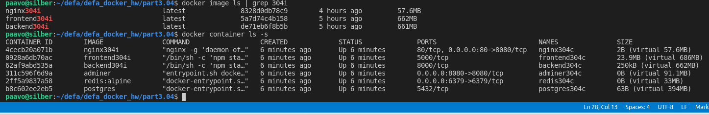
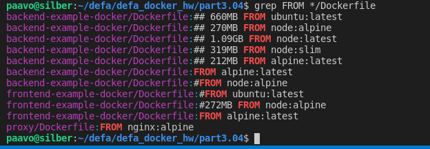
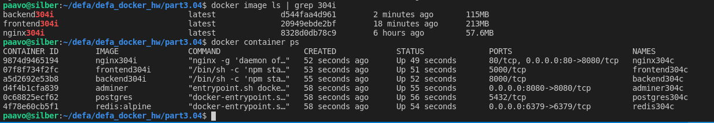

# 3.04 [x] Switch to node docker packages and document before and after sizes of frontend and backend

   Based on 2.10 setup move to app-user from root. I am using this to be able to exec to shell and see.
    Otherwise could do it based on 3.01.

Glory for the backend and frontend goes to Helsinki https://github.com/docker-hy

### BEFORE *docker304 and AFTER *304i
    $ docker image ls | grep 304 | grep end
    backend304i                             latest              d544faa4d961        24 minutes ago      115MB
    frontend304i                            latest              20949ebde2bf        40 minutes ago      213MB
    vaapo/frontend-example-docker304        latest              5a7d74c4b158        8 hours ago         662MB
    vaapo/backend-example-docker304         latest              de71eb6f8b5b        8 hours ago         661MB
    paavo@silber:~/defa/defa_docker_hw$ docker image ls | grep 304i
    nginx304i                               latest              8328d0db78c9        3 hours ago         57.6MB
    frontend304i                            latest              5a7d74c4b158        5 hours ago         662MB
    backend304i                             latest              de71eb6f8b5b        5 hours ago         661MB
    
    $ docker container ps -s
    CONTAINER ID        IMAGE               COMMAND                  CREATED             STATUS              PORTS                          NAMES               SIZE
    9874d9465194        nginx304i           "nginx -g 'daemon of…"   24 minutes ago      Up 24 minutes       80/tcp, 0.0.0.0:80->8080/tcp   nginx304c           2B (virtual 57.6MB)
    07f8f734f2fc        frontend304i        "/bin/sh -c 'npm sta…"   24 minutes ago      Up 24 minutes       5000/tcp                       frontend304c        23.9MB (virtual 237MB)
    a5d2692e53b8        backend304i         "/bin/sh -c 'npm sta…"   24 minutes ago      Up 24 minutes       8000/tcp                       backend304c         250kB (virtual 116MB)
    d4f4b1cfa839        adminer             "entrypoint.sh docke…"   24 minutes ago      Up 24 minutes       0.0.0.0:8080->8080/tcp         adminer304c         0B (virtual 91.1MB)
    0c68825ecf62        postgres            "docker-entrypoint.s…"   24 minutes ago      Up 24 minutes       5432/tcp                       postgres304c        63B (virtual 394MB)
    4f78e60cb5f1        redis:alpine        "docker-entrypoint.s…"   24 minutes ago      Up 24 minutes       0.0.0.0:6379->6379/tcp         redis304c           0B (virtual 33MB)

## screenshots

