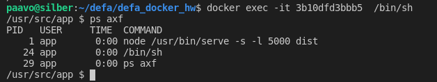

# 3.06 Do all or most of the optimizations from security to size.

    - docker installed in **host** operating system so that **no sudo** needed to run docker-commands
    - define httpd 80 port in docker-compose.yml - while nginx **proxy is in 8080, non-privileged port**
    - use **app-user** in group dockerapp **to run services**: proxy, frontend, backend
    - all **files** copied and created during build and launch are **owned by app-user**
      - no root owned files
    - postgres and redis **databases survives up-down cycles** and data persists
      - related volumes have human-readable names part306_database, part306_redisdata
    - frontend and backend are **multistage built**
      - they have phases: *BASE node, DEPENDENCIES, TEST, RELEASE*
      - in RELEASE **minimal set of files** and directories required **to run/serve** the service
      - **1/6 size** of frontend/backend images due optimization and use of alpine/node
    - *redis doesnt have password
    - password files with obfuscation are not used*

    Functionality is still the same as in 2.10 exercise:

## screenshots

