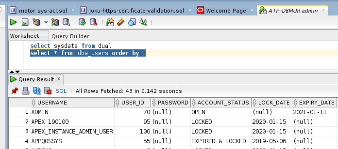
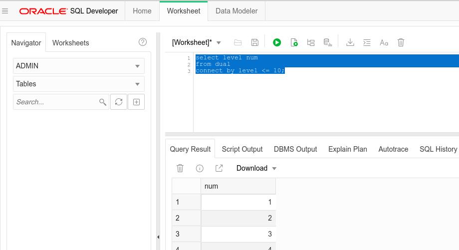
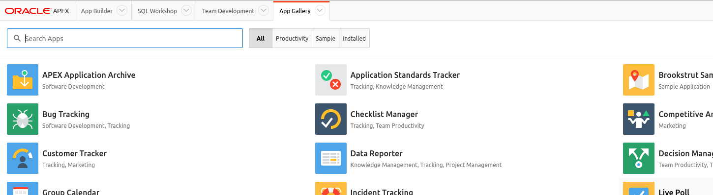
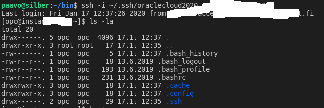
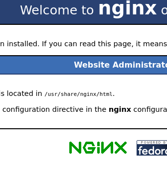
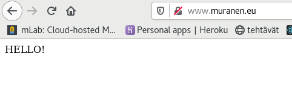
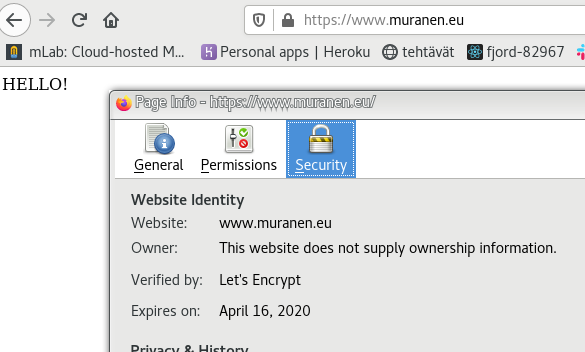

# [x] 3.08 Create an example setup that uses Kubernetes, Docker Swarm or equivalent using any project and deploy it online.

    Lets see what Oracle free cloud gives.
    https://dgielis.blogspot.com/2019/09/best-and-cheapest-oracle-apex-hosting.html

## [x] 1. Sign-up for Free Oracle Cloud
## [x] 2. Setup Autonomous Transaction Cloud (ATP)
## [x] 3. Connecting with SQL Developer (Desktop) to ATP

## [x] 4. Connecting with SQL Developer Web to ATP

## [x] 5. Setup APEX in ATP and create the first APEX app

## [x] 6. Create a VM Instance (Compute Cloud)

## [x] 7. Setup a Webserver on the Compute Instance (VM)
installed nginx, configured fw and added ingressrules to virtual cloud security lists

fixed dns and homepage for http://www.muranen.eu/

fixed ssl cert and forced https

Oracle Apex works in https://www.muranen.eu/ords/

## [] 8. Setup APEX Office Print (AOP) to export to PDF, Excel, Word, Powerpoint, HTML and Text

    [] 9. Setup Object Storage and use for File Share and Backups
    [] 10. Running SQLcl and Datapump from the Compute Instance (VM) to ATP
    [] 11. Sending Emails with APEX_MAIL on ATP
    [] 12. Create a 2nd Compute Instance and a Load Balancer
    [] 13. Final things to take away
    [] 14. Message: Your Oracle Cloud Free Trial has expired (but FREE keeps running)
    [] 15. Error: The request could not be mapped to any database
    [] 16. Renewing Let's Encrypt certificate
    [] 17. Configure domain to redirect to APEX app
    [] 18. Monitoring your website and APEX app

# [] Install docker stuff to Oracle free cloud server

https://community.oracle.com/blogs/mahmoudrabie/2019/03/06/installing-docker-ce-on-oracle-linux-7
    howto for CE docker on oracle linux
    [x] create mortal user and add to docker-group
    [x] https://stackoverflow.com/questions/56870478/cannot-start-docker-container-in-docker-ce-on-oracle-linux

    [paavo@instance-mur ~]$ docker pull hello-world
    Using default tag: latest
    latest: Pulling from library/hello-world
    1b930d010525: Pull complete 
    Digest: sha256:9572f7cdcee8591948c2963463447a53466950b3fc15a247fcad1917ca215a2f
    Status: Downloaded newer image for hello-world:latest
    docker.io/library/hello-world:latest
    [paavo@instance-mur ~]$ docker run hello-world
    docker: Error response from daemon: OCI runtime create failed: container_linux.go:346: starting container process caused "process_linux.go:449: container init caused \"write /proc/self/attr/keycreate: permission denied\"": unknown.

    [paavo@instance-mur ~]$ docker run hello-world
    
    Hello from Docker!

https://docs.docker.com/v17.09/engine/installation/linux/docker-ee/oracle/
    Docker Community Edition (Docker CE) is not supported on Oracle Linux.
    Can see docker and kubernetes stuff with yum search, but going to install the CE docker stuff instead.

